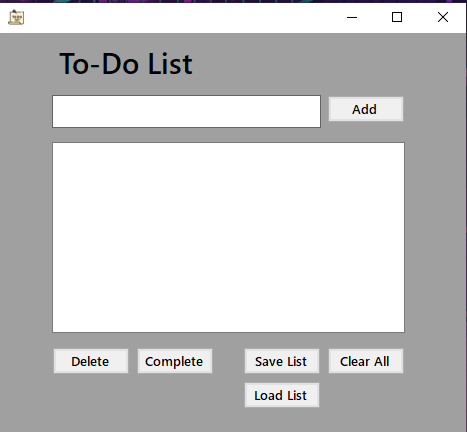

# To-Do List - Windows Forms App

A simple **C# Windows Forms To-Do List app** for managing tasks efficiently.  
Built as a portfolio project while learning desktop GUI apps. Add tasks, mark them complete, delete, save, and load them from custom file locations.  

---

## 🖥️ Screenshots

**Main UI:**  

**Adding a Task:**  

---

## ⚡ Features

- Add tasks with a text input  
- Mark tasks as complete with a ✔ checkmark  
- Delete individual tasks  
- Save tasks to a custom file location  
- Load tasks from a previously saved file  
- Clear all tasks with confirmation  
- Prevents duplicate tasks for cleaner lists  

---

## 📥 Download & Run

Download the latest release (compiled `.exe`) from GitHub:  

[Download To-Do List Release](https://github.com/fuwadog/CSharp-TodoList-WinForms/releases/download/v1.0/TodoList-Release-v1.0.rar)  

**Instructions:**  
1. Extract the zip/rar file.  
2. Run `TodoList.exe`.  
3. Start adding, completing, and managing your tasks!

---

## 🛠️ Tech Stack & IDE

- **Language:** C#  
- **IDE:** Visual Studio 2022  
- **Framework:** .NET 8.0 (Windows Forms)  
- **OS:** Windows  

---

## 💡 Notes

- This project may contain beginner-to-intermediate code as part of learning.  
- Screenshots and code are provided for reference.  

---
